## 설계 구조

### 폴더 구조
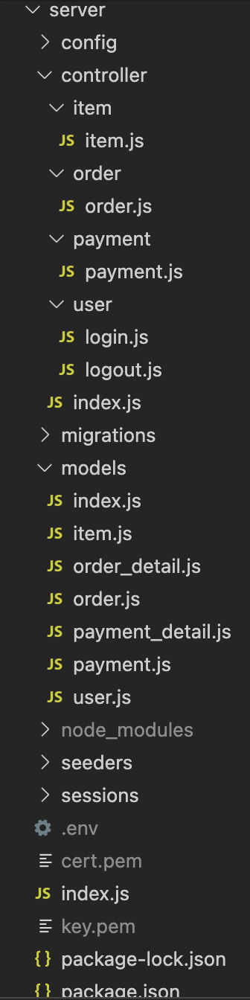

### DB SCHEMA
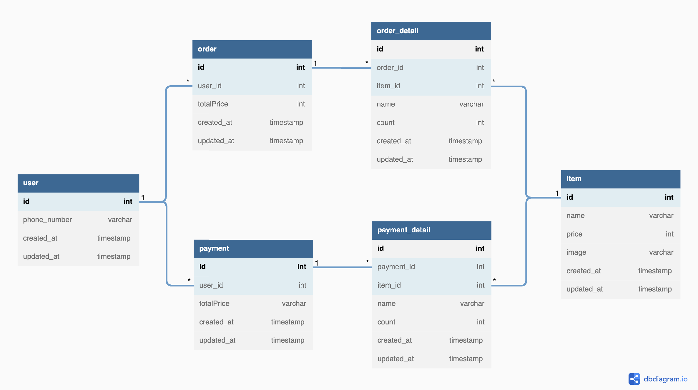

### API
* API문서: <https://jiji6027.gitbook.io/torder-test-api/>

### 사용 스택

***

## 간단한 코드 설명

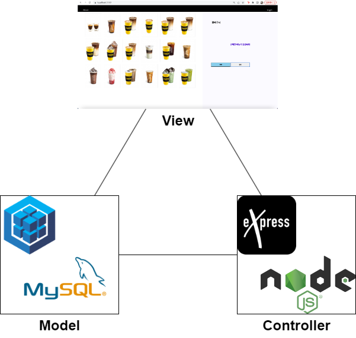
node.js와 sequelize ORM을 사용하여 MVC 모델을 구성했습니다.

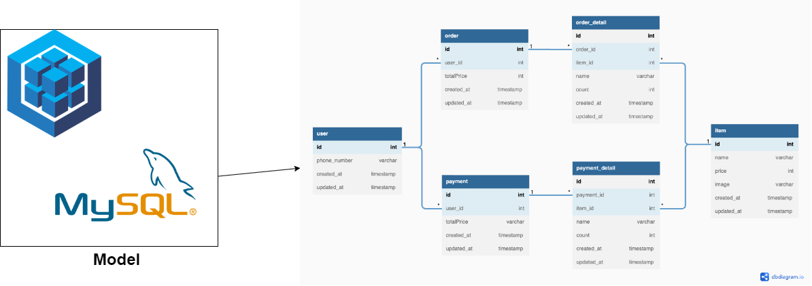
DB의 경우 MySQL을 사용했습니다. 
Model은 user, item, order, order_detail, payment, payment_detail로 총 6개의 테이블을 구성했습니다. 

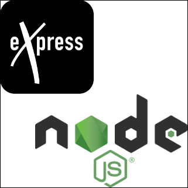
Controller는 login, logout, item, order, payment로 총 5개로 구성했습니다.
HTTPS를 사용했고, express를 사용했습니다.
session을 사용했고, session을 만들고 cookie를 통해 주고 받기 위해 express-session과 cookie-parser를 사용했습니다. session을 계속 유지하기 위해 session-file-store를 활용했습니다. 환경변수를 활용하기 위해 dotenv도 사용했습니다.

### login
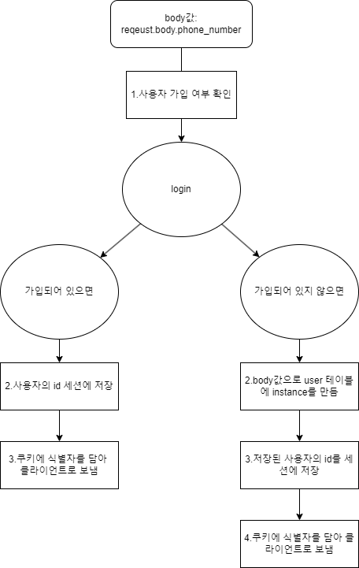

### logout
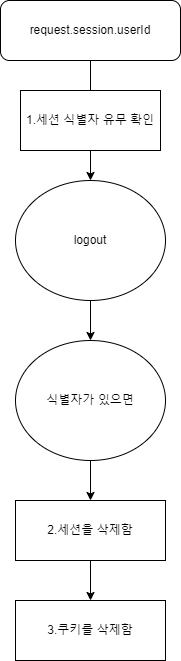

### order
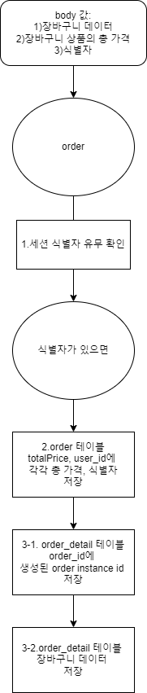

### payment
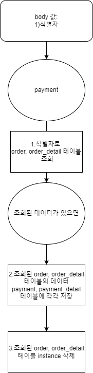

***

## 결과 화면

### 메인 화면
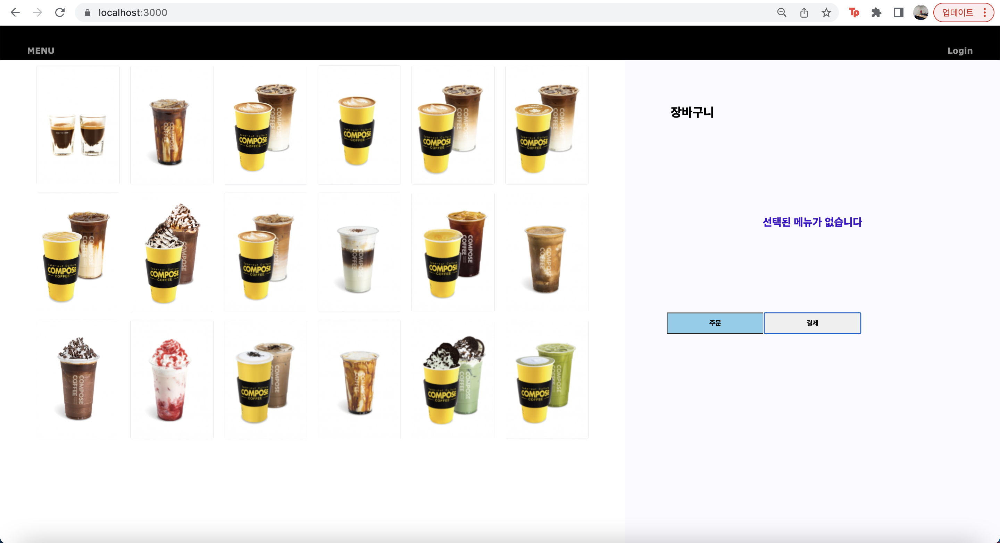

### 로그인 화면
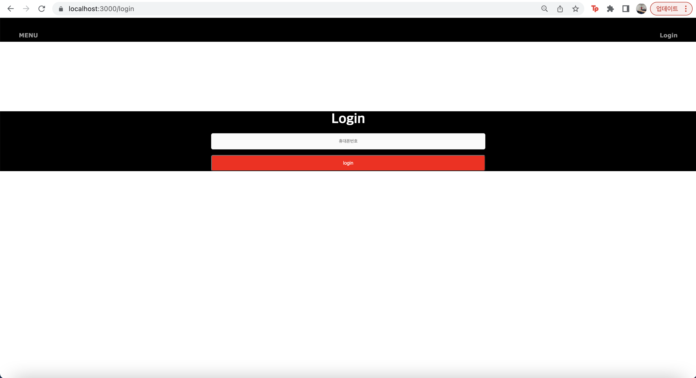

### 로그인된 화면

### 메뉴선택 화면

### 장바구니 화면

### 주문 버튼 클릭 화면

### 주문 후 order 테이블

### 주문 후 order_detail 테이블

### 결제 버튼 클릭 화면

### 결제 후 payment 테이블

### 결제 후 payment_detail 테이블

### 결제 후 order 테이블

### 결제 후 order_detail 테이블

